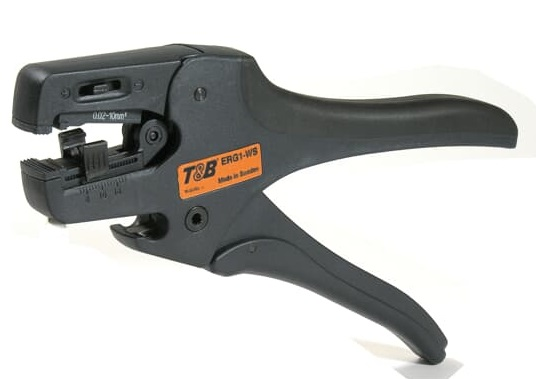



# Tools
{: .no_toc }

A collection of my observations about tools.
{: .fs-6 .fw-300 }

Even monkeys use them. We're not *that* special :)
{: .fs-3 .fw-300}

---

## Wire Stripper, Who Art Thou?
*circa 2011*

{: .float-right .spaced}

Here is a 8-34AWG self-adjustable wire stripper. The same product is offered under three brands: Thomas&Betts, Molex and Cooper/Xcelite.

The prices offered for each of those can vary by a small integer factors, even though every row in the table below seems to be exactly the same part.

To help in your search of best deals, peruse this here table.

<table>
  <tr> <th>Item</th> <th>T&B</th> <th>Molex</th> <th>Cooper/Xcelite</th> </tr>
  <tr>
    <td>Stripper w/Straight Blade</td>
    <td markdown="span">[ERG1-WS](https://octopart.com/erg1-ws-thomas+%26+betts-55603564)</td>
    <td markdown="span">[63817-0000](https://octopart.com/63817-0000-molex-828306)</td>
    <td markdown="span">[SAS3210](https://octopart.com/sas3210-xcelite-39446478)</td>
  </tr>
  <tr>
    <td>Straight Blade for regular wire</td>
    <td markdown="span">SBC-1 *seems to be discontinued*</td>
    <td markdown="span">[63817-0070](https://octopart.com/63817-0070-molex-828269)</td>
    <td markdown="span">[SAS3210RB](https://octopart.com/sas3210rb-apex+tool+group-38952240)</td>
  </tr>
  <tr>
    <td>V-Shaped Blade for teflon wire</td>
    <td markdown="span">[VBC-1](https://octopart.com/vbc-1-thomas+%26+betts-40317070)</td>
    <td markdown="span">[63817-0071](https://octopart.com/63817-0071-molex-828610)</td>
    <td markdown="span">[SAS3210TRB](https://octopart.com/sas3210trb-xcelite-39448707)</td>
  </tr>
  <tr>
    <td>PVC #10-#5 blade</td>
    <td markdown="span">*none known*</td>
    <td markdown="span">[63817-0072](https://octopart.com/63817-0072-molex-7662906)</td>
    <td markdown="span">*none known*</td>
  </tr>
</table>

